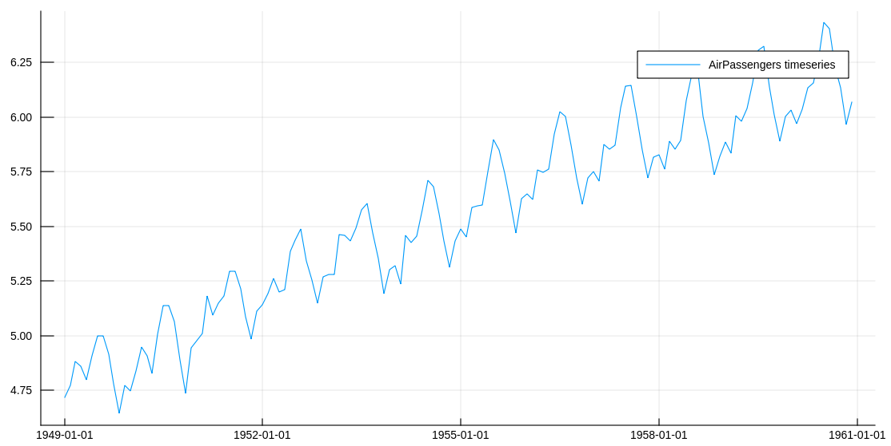

# Manual

## Introduction

In this package we consider the following state space model

```math
\begin{gather*}
    \begin{aligned}
        y_t &= Z_t \alpha_t  + \varepsilon_t \quad \quad \quad t = 1 \dots n\\
        \alpha_{t+1} &= T_t \alpha_t + R_t \eta_t
    \end{aligned}
\end{gather*}
```
where
```math
\begin{bmatrix}
    \varepsilon_t \\
    \eta_t \\
    \alpha_1
\end{bmatrix}
\sim
NID
\begin{pmatrix}
    \begin{bmatrix}
        0 \\
        0 \\
        a_1
    \end{bmatrix}
    ,
    \begin{bmatrix}
        H_t & 0 & 0\\
        0 & Q_t & 0\\
        0 & 0 & P_1\\
    \end{bmatrix}
\end{pmatrix}
```


## Data Structures

```@docs
StateSpaceDimensions
StateSpaceModel
StateSpaceParameters
SmoothedState
FilterOutput
StateSpace
```

## Estimation
The model estimation is made using the function `statespace(y, s; X, nseeds)`. It receives as argument the time series `y` and the desired seasonality `s`. The user can input exogenous variables using optional argument `X` and specify the desired number of random seeds `nseeds` to perform the estimation.

```julia
ss = statespace(y, s; X = X, nseeds = nseeds)
```

## Simulation

Simulation is made using the function `simulate`. It receives as argument a `StateSpace` object, the number of steps ahead `N` and the number of scenarios to simulate `S`.

```julia
simulation = simulate(ss, N, S)
```

## Example

Let's take the Air Passenger time series to build and example. Taking the log of the series we should have a nice time series to simulate. The code is in the example folder.

```julia
using CSV, StateSpaceModels, Plots, Statistics, Dates

#load the AirPassengers dataset
AP = CSV.read("AirPassengers.csv")

#Take the log of the series
logAP = log.(Array{Float64}(AP[:Passengers]))

p1 = plot(AP[:Date], logAP, label = "AirPassengers timeseries", size = (1000, 500))
```



Estimating a StateSpaceModel gives us the trend and seasonal components of the time series.

```julia
#Define its seasonality 
s = 12

#Estimate a StateSpace Structure
ss = statespace(logAP, s)

#Analyze its decomposition in seasonal and trend
p2 = plot(AP[:Date], ss.state.seasonal, label = "AirPassengers seasonal", size = (1000, 500))
p3 = plot(AP[:Date], ss.state.trend, label = "AirPassengers trend", size = (1000, 500))
```


We can also simulate future scenarios for this time series. In this example, we simulate 100 scenarios up to five years (60 observations) ahead.

```julia
#Simulate 100 scenarios, 60 steps ahead
num_scenarios = 100
num_steps_ahead = 60
simulation = simulate(ss, num_steps_ahead, num_scenarios)

#Define simulation dates
firstdate = AP[:Date][end] + Month(1)
newdates = collect(firstdate:Month(1):firstdate + Month(num_steps_ahead - 1))

#Evaluating the mean of the forecast and its quantiles
simulation_mean = mean(simulation, dims = 3)[1, :, :]

n = length(logAP)
nmonths = length(simulation[1, :, 1])
simulation_q05 = zeros(nmonths)
simulation_q95 = zeros(nmonths)
for t = 1:nmonths
    simulation_q05[t] = quantile(simulation[1, t, :], 0.05)
    simulation_q95[t] = quantile(simulation[1, t, :], 0.95)
end

plot!(p1, newdates, [simulation_q05, simulation_mean, simulation_q95], labels = ["5% quantile", "mean", "95% quantile"])
```


## Reference

```@docs
size
ztr
```